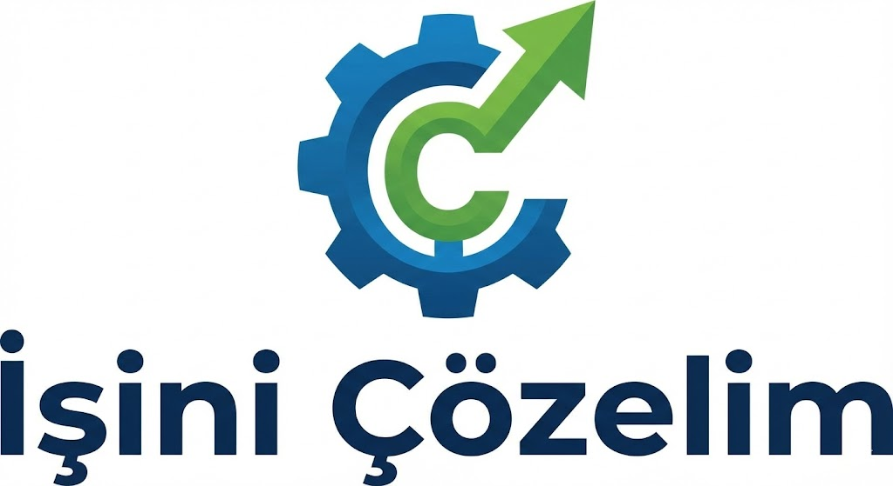

# 🚀 İşini Çözelim - Kurumsal Web Sitesi Projesi



**İşini Çözelim**, modern yazılım çözümlerini (Rent a Car, Dans Okulu vb.) ve ileri teknoloji saha operasyonlarını (Drone ile temizlik, Yalıtım) tek bir çatı altında toplayan hibrit bir hizmet firmasının kurumsal web sitesidir.

Bu proje, **Next.js 14**, **TypeScript** ve **Tailwind CSS** kullanılarak geliştirilmiş, yüksek performanslı, SEO uyumlu ve tamamen mobil uyumlu (responsive) bir yapıdadır.

---

## 🌟 Proje Önizlemesi

Sitenin ana ekranı ve kullanıcı arayüzü, modern tasarım prensipleriyle oluşturulmuştur.


---

## 🛠️ Kullanılan Teknolojiler

Bu proje en güncel web teknolojileri ile inşa edilmiştir:

- **Framework:** [Next.js 15](https://nextjs.org/) (App Router)
- **Dil:** [TypeScript](https://www.typescriptlang.org/)
- **Stil:** [Tailwind CSS](https://tailwindcss.com/)
- **İçerik Yönetimi (Blog):** MDX & Gray-matter
- **Animasyonlar:** AOS (Animate On Scroll)
- **İkon Seti:** Iconify
- **Slider:** React Slick
- **Form & Bildirimler:** React Hot Toast

---

## 💼 Hizmetlerimiz ve Özellikler

Proje, aşağıdaki 5 ana sektörü kapsayacak şekilde özelleştirilmiştir:

### 1. 🚗 Rent a Car Yazılımı
Araç filosu, rezervasyon takibi ve müşteri yönetimi için geliştirilen otomasyon çözümlerinin tanıtımı.

### 2. 🛸 Drone ile Plaza Temizliği
Yüksek katlı binalar için iş güvenliği riskini sıfıra indiren, drone destekli dış cephe temizlik hizmeti sayfası.

### 3. 💃 Dans Okulu Yazılımı
Öğrenci kayıt, ders programı ve eğitmen takibi sağlayan yönetim panelinin sunumu.

### 4. 🧱 Bina Yalıtımı
Enerji tasarrufu sağlayan profesyonel mantolama ve izolasyon hizmetleri.

### 5. 💻 Web & Mobil Yazılım
Kurumsal web siteleri ve özel yazılım projeleri için geliştirme hizmetleri.

---

## 📂 Proje Yapısı

Proje, modüler ve sürdürülebilir bir dosya yapısına sahiptir:

```bash
├── 📁 markdown/          # Blog yazıları (MDX formatında)
├── 📁 public/            # Statik dosyalar (Görseller, ikonlar)
│   ├── 📁 images/        # Proje görselleri
│   └── ...
├── 📁 src/
│   ├── 📁 app/           # Next.js App Router sayfaları (Home, About, Services...)
│   ├── 📁 components/    # Yeniden kullanılabilir bileşenler (Header, Footer, Hero...)
│   ├── 📁 types/         # TypeScript tip tanımları
│   └── 📁 utils/         # Yardımcı fonksiyonlar
├── 📄 next.config.mjs    # Next.js konfigürasyonu
├── 📄 tailwind.config.ts # Tailwind CSS ayarları
└── 📄 package.json       # Bağımlılıklar ve scriptler
